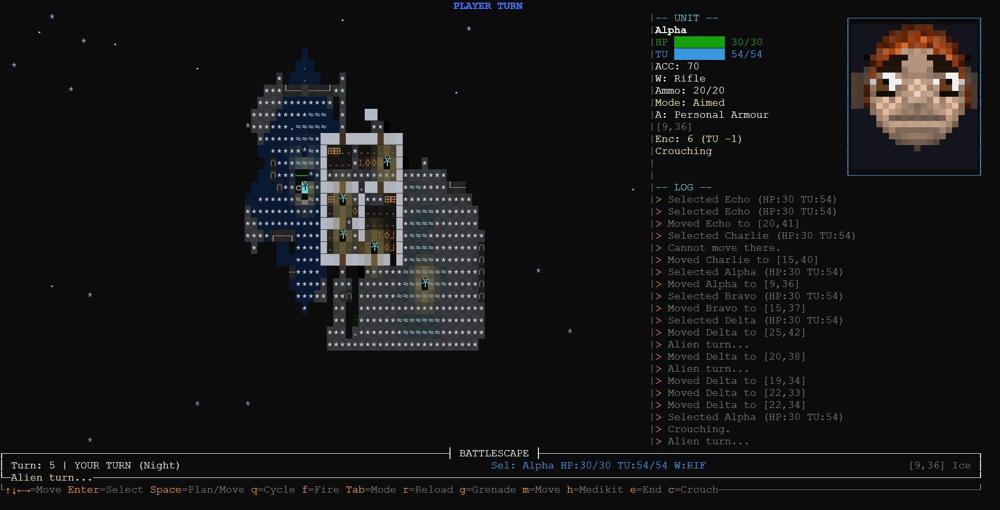
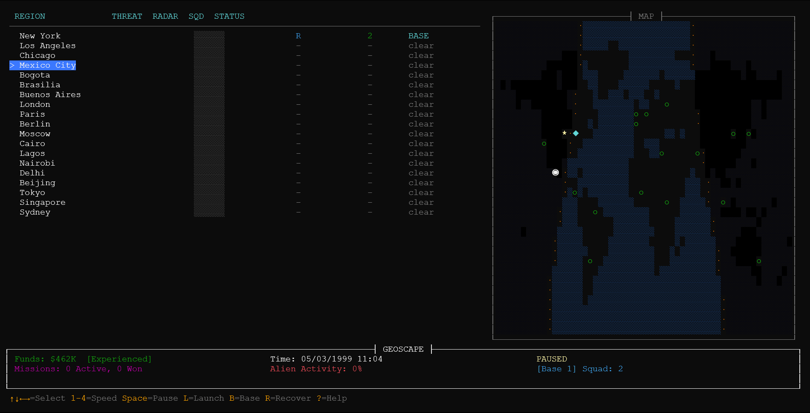

# TERMCOM：一款纯 ASCII 的 X-COM 重制版

[English](README.md) | [Español](README.es.md) | [Français](README.fr.md) | [Português](README.pt.md) | [Русский](README.ru.md) | [中文](README.zh.md) | [日本語](README.ja.md) | [한국어](README.ko.md)

一款 **X-COM：UFO Defense**（1994，MicroProse）的 rogue-like 重制版，完全用彩色 ASCII 字符在终端中呈现。使用 Go 语言与 [tcell](https://github.com/gdamore/tcell) 库编写，将经典的对抗外星人入侵的策略体验带到了你的终端。游戏完整实现了所有玩法循环：地球战略层（Geoscape）、基地管理，以及战术战斗层（Battlescape）。

[](https://go.dev/) [](https://github.com/taislin/termcom/blob/master/LICENSE) [](https://github.com/taislin/termcom/releases/latest)

[](https://github.com/taislin/termcom/releases/latest) [](https://taislin.github.io/termcom) [](https://taislin.github.io/termcom/manual.html) [](docs/dev.md)

<p align="center">
<a href="screenshots/battlescape.png"></a> <a href="screenshots/geoscape.png"></a>
</p>

## 特性

- **Geoscape（地球战略层）** — 实时世界地图，支持时间压缩、UFO 追踪与拦截机出击。
- **Battlescape（战术战斗层）** — 回合制战术战斗，包含时间单位（TU）、掩体系统与视线（LOS）。
- **基地管理** — 建造设施、招募士兵、武装小队。
- **研究与制造** — 解锁外星科技，制造等离子步枪与动力装甲。
- **外星人 AI** — 具备巡逻、搜索、攻击、逃跑、侧翼包抄与撤退等行为。
- **程序化生成的外星人** — 每场战役开始时生成一套外星人名单，每个都拥有独特的能力、优势、弱点与武器。
- **可破坏地形** — 手榴弹可摧毁墙壁、树木与岩石，留下瓦砾。
- **动态视觉特效** — 粒子爆炸、屏幕震动、瓦砾物理效果与夜间光照。

## 运行要求

> [!TIP]
> 以下内容介绍如何从源代码进行构建。如果你只想游玩，可以从[这里](https://github.com/taislin/termcom/releases/latest)下载游戏可执行文件。

- Go 1.25 及以上
- 支持 Unicode 的终端（用于显示制表符与方框绘制字符）

### 终端字体排错

**termcom** 大量使用扩展 Unicode 字符（如卢恩字母、几何图形与埃塞俄比亚符号）来渲染外星人与战术地图。绝大多数设备都应支持我们所使用的字符，但如果你在终端中直接运行游戏时看到字符重叠、间距异常或空方框（□）而非外星人，说明你的系统缺少所需的回退字体。

#### 在 Linux 上

要在 **Ubuntu/Debian** 上修复，请安装 Noto 字体与 Unifont 回退字体包：

```bash
sudo apt update
sudo apt install fonts-noto fonts-unifont
```

对于 **Arch Linux** 用户：

```bash
sudo pacman -S noto-fonts unifont
```

对于 **Fedora** 用户：

```bash
sudo dnf install google-noto-sans-fonts unifont-fonts
```

#### 在 macOS 上

macOS 自带的 `Terminal.app` 有时会在网格对齐上出现问题，或错误地将符号渲染为双宽 emoji。

为了获得最佳体验，我们强烈推荐使用 **[iTerm2](https://iterm2.com/)**。如果你缺少某些字符，可以通过 Homebrew 安装 GNU Unifont：

```bash
brew install --cask font-gnu-unifont
```

* **在 iTerm2 中修复对齐问题：** 进入 **Settings > Profiles > Text**，勾选 *“Use a different font for non-ASCII text”*（为非 ASCII 文本使用不同字体）选项，并将该辅助字体设置为 `Unifont`。

#### 在 Windows 上

请勿使用传统的命令提示符（`cmd.exe`）或老旧的蓝色 PowerShell 窗口，因为它们对 Unicode 与颜色的支持极其有限。

1. 使用 **[Windows Terminal](https://apps.microsoft.com/store/detail/windows-terminal/9N0DX20HK701)**（Windows 11 默认自带，Windows 10 可在 Microsoft Store 中获取）。
2. 如果你看到空方框 `□`，说明系统默认字体缺少所需符号。
3. 下载并安装一款兼容性强、稳健的字体，例如 **[GNU Unifont](http://unifoundry.com/unifont/)** 或 **[Noto Sans Mono](https://fonts.google.com/noto/specimen/Noto+Sans+Mono)**。
4. 打开 Windows Terminal 设置（`Ctrl + ,`），进入 **Profiles > Defaults > Appearance**（配置项 > 默认 > 外观），将 **Font face**（字体）改为你新安装的字体。

## 构建与运行

### 终端版本

```bash
go run ./cmd/termcom
```

或者构建为可执行文件：

```bash
go build -o termcom ./cmd/termcom
./termcom
```

### 浏览器版本（实验性）

> [!CAUTION]
> 浏览器版本尚处于实验阶段，与终端版本相比可能功能有限。
> 
浏览器版本允许你通过 xterm.js 在网页浏览器中游玩 termcom。

1. 启动 Web 服务器：

```bash
go run ./cmd/webserver
```

2. 打开你的浏览器并访问：

```
http://localhost:8080
```

浏览器版本支持：

- 通过 xterm.js 实现完整的键盘输入
- 响应式的终端尺寸调整
- 全部游戏功能（Geoscape、Battlescape、基地管理）
- **移动端触控游玩** — 点按即点击、长按为右键、拖拽为滚动，并带有上下文相关的屏幕控制菜单

### 浏览器版本 (WASM)

> [!NOTE]
> WASM 版本无需 Go 后端服务器，直接在浏览器中原生渲染。

WASM 版本将 Go 游戏核心编译为 WebAssembly，通过支持 TrueColor ANSI 的 HTML Canvas 渲染器直接在浏览器中渲染。

**快速开始：**

```bash
# 构建 WASM 二进制文件
cd cmd/termcom_wasm
GOOS=js GOARCH=wasm go build -o ../../web_wasm/termcom.wasm .

# 本地服务
cd web_wasm
python -m http.server 8080
```

或使用构建脚本：

```bash
./scripts/build_wasm.sh    # Linux/macOS
.\scripts\build_wasm.ps1   # Windows
```

然后打开 `http://localhost:8080`。

**特性：**
- 浏览器原生渲染（无需后端服务器）
- 支持 TrueColor ANSI RGB 的 Canvas 字符网格
- 差分渲染（仅重绘变更的单元格）
- 通过 CSS Transform 实现屏幕震动效果
- 基于单元格尺寸的自动字体缩放（可通过 URL 参数 `?font=字体名` 覆盖）
- 移动端触控支持（点按即点击、长按为右键、拖拽为滚动）

### Android 原生版本（实验性）

> [!CAUTION]
> Android 版本尚处于实验阶段，与终端版本相比可能功能有限。

Android 移植版通过 [gomobile](https://pkg.go.dev/golang.org/x/mobile/cmd/gomobile) 将 Go 游戏核心编译为原生 `.aar` 库，在 `SurfaceView` 上以字符网格形式渲染，并支持完整的触控输入与音频。

**前置条件：**

- Go 1.25 及以上
- Android SDK + NDK（API 21 及以上）
- Gradle 8.2（用于本地 APK 构建）
- `gomobile`：
  ```bash
  go install golang.org/x/mobile/cmd/gomobile@latest
  gomobile init
  ```

**构建游戏库：**

```bash
make android-aar
```

这会写入 `android/app/libs/termcom.aar`。

**构建 APK（CI / GitHub Actions）：**

`.github/workflows/android-release.yml` 工作流会在推送到 `mobile`/`main`/`master` 分支以及打上 `v*` 标签时，自动构建已签名的发布版 APK（或调试版 APK）。调试版 APK 在任意推送时生成；为某个发布版本打上标签（`v*`）即可将已签名的 APK 发布为 GitHub Release。为已签名发布，请设置以下仓库密钥：`ANDROID_KEYSTORE_BASE64`、`ANDROID_KEYSTORE_PASSWORD`、`ANDROID_KEY_ALIAS`、`ANDROID_KEY_PASSWORD`。

**在本地构建 APK：**

```bash
make android-aar                                  # 第 1 步：Go .aar
cd android && gradle assembleDebug               # 第 2 步：APK → app/build/outputs/apk/debug/
# 或在 Android Studio 中打开 android/ 并运行
```

使用 `adb install android/app/build/outputs/apk/debug/app-debug.apk` 安装。

**操控方式：**

- 点按即点击 / 选择 / 移动
- 长按（500 毫秒）为右键 / 取消；长按时产生震动反馈
- 拖拽为滚动
- 支持实体键盘（方向键、Enter、Escape、功能键）

## 项目结构

有关架构细节，请参阅 [AGENTS 文件](AGENTS.md)。

## 许可证

MIT，详见 [LICENSE](LICENSE) 文件。

> [!NOTE]
> ***AI 使用声明***：本项目使用 AI 生成并更新了法语、西班牙语、俄语、韩语、中文与日语的翻译。音频与图像均未通过 AI 生成（无论如何，本游戏并不使用任何音频或图像 —— 它完全基于终端）。
